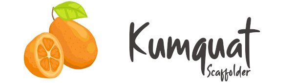

* **[Kumquat Scaffolder](#intro)**
* **[Installation](#installation)**
* **[Usage](#usage)**
* **[Troubleshooting](#troubleshooting)**
* **[Credits](#credits)**

# <a name="intro"></a>Kumquat Scaffolder

Kumquat scaffolder is a package that helps you start your Drupal projects faster by scaffolding an install profile, a front theme and a back theme for you.

It's compatible with Drupal 8 and 7 and is meant to be used by developers at the very beginning of a new project.

## <a name="installation"></a>Installation

- `composer require happyculture/kumquat_scaffolder:@beta --dev`

## <a name="usage"></a>Usage

- Use `drupal kumquat:generate-project` to initiate your project files.

## <a name="troubleshooting"></a>Troubleshooting

If you encounter the following error:

```
  [InvalidArgumentException]                              
  Package type "drupal-console-library" is not supported 
```

Add this line to the `composer.json` file to specify the package location in the `extra` > `installer-paths` section.

`"vendor/{$vendor}/{$name}": ["type:drupal-console-library"]`

# <a name="credits"></a>Credits

The font used for the logo is [Smooth Butter from PutraCetol Studio](https://putracetol.com/product/smooth-butter/).
